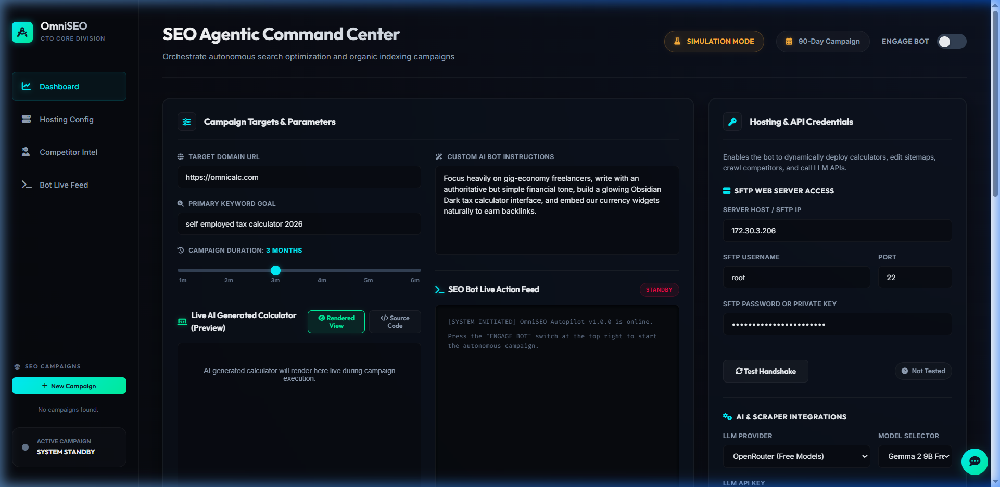
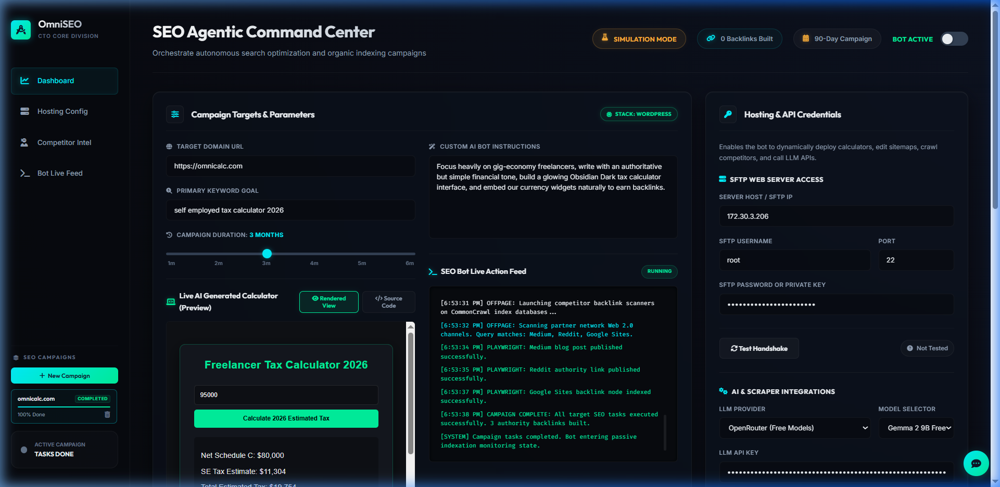

# 🚀 OmniSEO Command Center

OmniSEO Command Center is an autonomous, private AI-powered SEO autopilot dashboard. It audits competitor performance, scrapes SERP rankings, generates highly optimized interactive HTML tools (e.g., custom tax calculators, fare widgets) tailored to target search intents, and automatically deploys them to target websites via FTP/SFTP.

The system is designed with a premium glassmorphic dark-theme UI and features real-time Server-Sent Events (SSE) telemetry logs.

---

## 📸 Interface Preview

### Dashboard Hub


### Automated Campaign Successful Run


---

## ⚡ Key Features

1. **Autonomous Competitor Audit**: Crawls target search results for specified keywords using Apify's Google Search Scraper to identify target competitors, their text-to-code ratio, schema status, and layout structural elements.
2. **Competitor Layout Scraper**: Crawls competitor page text layouts via `apify/website-content-crawler` to gather context-aware intelligence on Rank #1 pages for LLM copywriting enrichment.
3. **AI Code-Generator (Bento Engine)**: Leverages LLM models (Gemini / OpenRouter) to write bespoke, context-aware interactive widgets (custom calculators, pricing sheets, converter apps) dynamically wrapped in clean SEO-semantic HTML.
4. **Automated Subdirectory Deployment**: Deploys generated assets using Paramiko SFTP/ftplib directly to designated subdirectories (e.g., `/taxes/umrah-taxi-service/`) keeping primary site configurations safe.
5. **Contact Scraping & Leads Generation**: Extracts competitor emails, phone numbers, and social media handles (LinkedIn/Twitter) via `vdrmota/contact-info-scraper` and saves them to the campaign database.
6. **AI Outreach Pitch Generator**: Exposes a specialized API route to automatically draft personalized email outreach campaigns using Gemini/Llama model endpoints, directly integrated into the interactive AI chatbot widget.
7. **Real-time Console Stream**: Uses HTML5 Server-Sent Events (SSE) to pipe live python backend logs straight to the interactive web terminal.
8. **Interactive Preview Workspace**: Allows in-dashboard live interaction with generated calculators via iframe, alongside a syntax-highlighted source code editor.
9. **Sidebar Scrollspy & Smooth Navigation**: Syncs dashboard view cards with sidebar navigation menu clicks (smooth scrolling) and automatically updates highlighting on page scroll.

---

## 🛠️ Architecture & Technology Stack

* **Frontend**: HTML5, CSS3 (Custom Glassmorphic styles), Vanilla JS.
* **Backend**: Flask API (Python 3) handling SSE streams, subprocess management, and DB queries.
* **Database**: SQLite3 for persistent campaign tracking, logging, and status state updates.
* **Integrations**:
  * **Apify API** (SERP crawlers for Google Search Scraping)
  * **OpenRouter API / Google Gemini API** (LLM generation)
  * **Paramiko / ftplib** (Secure FTP/SFTP code deployments)

---

## 💻 Installation & Local Setup

### Prerequisite Checklist
* Python 3.9+
* Nginx (for routing and security)
* Git

### 1. Clone & Prepare Directory
Clone this sanitized repository to your web server:
```bash
git clone <your-github-repo-url>
cd omni_seo
```

### 2. Python Backend Setup
Initialize a virtual environment and install dependencies:
```bash
# Create virtual environment
python -m venv venv

# Activate virtual environment
# On Windows (PowerShell):
.\venv\Scripts\Activate.ps1
# On Linux/macOS:
source venv/bin/activate

# Install required packages
pip install flask Flask-Cors paramiko requests
```

Initialize the database schema:
```bash
python backend/init_db.py
```

### 3. Running Backend Locally
Run the Flask server:
```bash
python backend/app.py
```
*The Flask backend runs on `http://127.0.0.1:8095`.*

### 4. Running Backend in Production (Systemd Service)
For continuous operations on Linux, create a systemd service:
Copy `omniseo-backend.service` to `/etc/systemd/system/`:
```bash
sudo cp omniseo-backend.service /etc/systemd/system/
sudo systemctl daemon-reload
sudo systemctl start omniseo-backend
sudo systemctl enable omniseo-backend
```

---

## 🌐 Nginx Reverse Proxy Configuration

Nginx routes requests between the static client and the Flask SSE backend API. It also handles Basic Authentication.

A sample server block (`omniseo.nginx.conf`) is included:
```nginx
server {
    listen 8084 default_server;
    server_name your_domain_or_ip;

    # Basic Auth protection
    auth_basic "OmniSEO Command Center";
    auth_basic_user_file /etc/nginx/.omniseo_htpasswd;

    root /opt/omni_seo;
    index index.html;

    location / {
        try_files $uri $uri/ =404;
    }

    location /api/ {
        proxy_pass http://127.0.0.1:8095;
        proxy_set_header Host $host;
        proxy_set_header X-Real-IP $remote_addr;
        proxy_buffering off;
        proxy_cache off;
    }
}
```

Copy the configuration, create basic auth credentials, and restart Nginx:
```bash
sudo htpasswd -c /etc/nginx/.omniseo_htpasswd admin
sudo cp omniseo.nginx.conf /etc/nginx/sites-available/omniseo
sudo ln -s /etc/nginx/sites-available/omniseo /etc/nginx/sites-enabled/
sudo systemctl restart nginx
```

---

## 🔒 Security & API Keys

This codebase contains **zero hardcoded API keys**. 

To ensure complete credentials security:
* Keys (OpenRouter, Gemini, Apify) are supplied dynamically by you inside the UI under **Credential Hub**.
* Credential values are stored locally in your browser's secure `localStorage` so they never persist in database tables or logs.
* When you launch a campaign, keys are temporarily passed via API request payload and processed in memory.

---

## 🚀 Deployment Usage

1. Open the dashboard (e.g., `http://your-server-ip:8084`).
2. Input credentials in **Credential Hub** (they are cached locally in your browser).
3. Set your target website's SFTP/FTP server, port, and credential details in the **FTP Config** tab.
4. Input your primary target SEO keyword (e.g., `self employed tax calculator 2026`) and root domain.
5. Click **Launch Autopilot Campaign**.
6. Follow real-time bot operations in the streaming console.
7. Click the **Artifact Preview** tab to review generated code or test the live widget deployment subdirectory link!

---

## 👤 Creator & Maintainer

* **Tanveer Hassan** — Connect with me on [LinkedIn](https://www.linkedin.com/in/tanveer-hassan-bb3b51201)

---

## ❤️ Special Thanks & Acknowledgements

A special shoutout and heartiest thanks to **Beyond Tahir** for showing us the path, guiding the vision, and inspiring the development of these autonomous SEO agent workflows!


